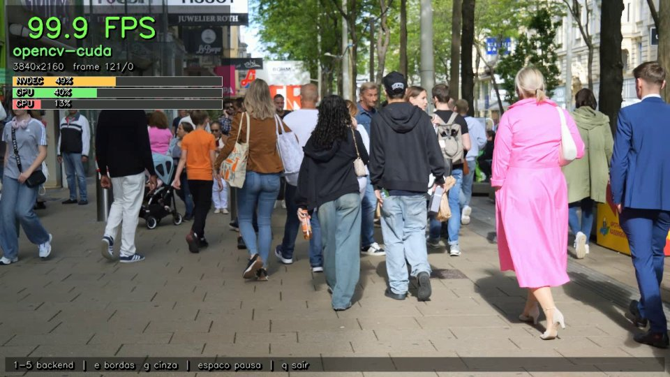
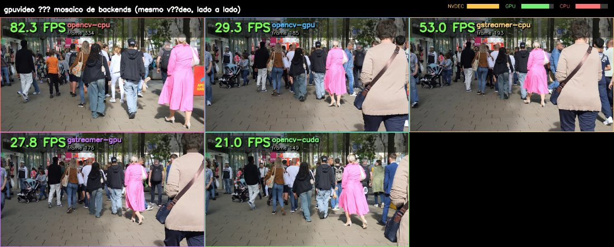
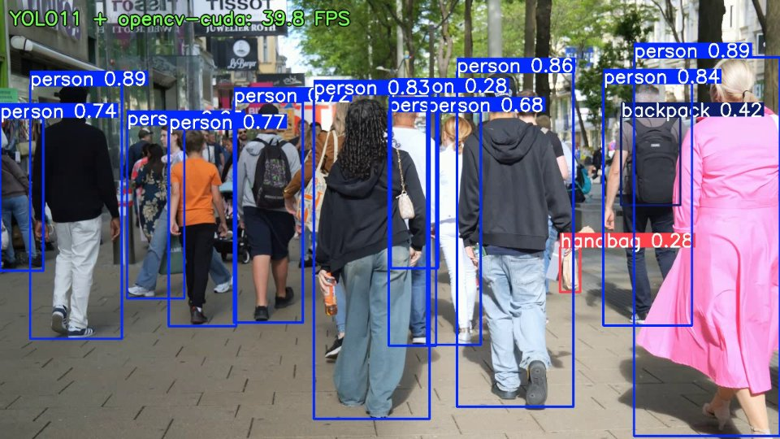
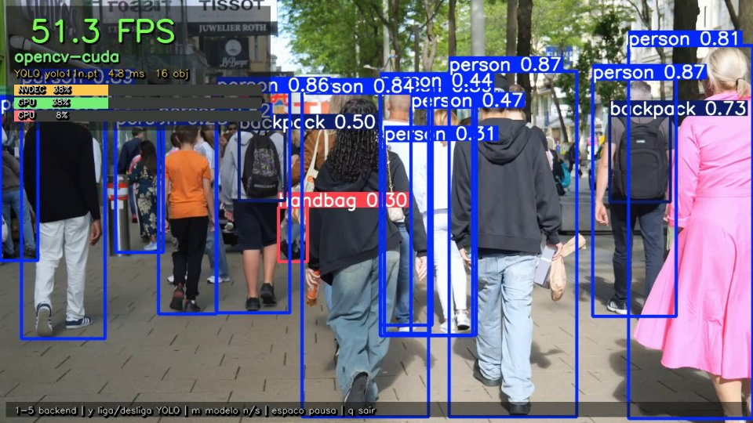

# gpuvideo — captura/processamento de vídeo OpenCV vs GStreamer (GPU)

Classes de **captura e processamento de vídeo aceleradas por GPU**, fáceis de
importar e escalar, mais um **harness de benchmark** que compara, de forma
justa e honesta, **OpenCV nativo** e **GStreamer** usando ao máximo a sua
NVIDIA (NVDEC para decode, NVENC para encode).

> Bancada de teste: **NVIDIA RTX 3050 6GB Laptop** (driver 595, CUDA 12.4),
> CPU de **16 núcleos**, Python 3.14, GStreamer 1.28, e **OpenCV 4.13 único
> compilado com CUDA + cudacodec + FFmpeg + GStreamer** (instalado em
> `/usr/local`, `import cv2` já traz tudo) — veja [docs/BUILD_CUDA.md](docs/BUILD_CUDA.md).

---

## TL;DR — qual é o melhor?

**Para usar a GPU ao máximo, o vencedor é o OpenCV compilado com CUDA
(`cv2.cudacodec`, NVDEC nativo).** Ele decodifica e converte a cor (NV12→BGR)
inteiramente na GPU, e o resultado bate todos os outros caminhos — em FPS,
em latência e em uso de CPU.

Comparativo de captura→numpy (1080p, conteúdo pesado, op=light), **5 modos no
mesmo cv2 unificado, mesma sessão**:

| modo | fps | speedup | NVDEC% | CPU sys% | latência p50 |
|---|---|---|---|---|---|
| 🥇 **opencv-cuda** (NVDEC nativo, `cv2.cudacodec`) | **639** | **1.45x** | 73 | 45 | **1.04 ms** |
| 🥇🥇 **opencv-cuda + processamento 100% na GPU** | **781** | 1.77x | — | baixo | — |
| opencv-gpu (cv2 consumindo NVDEC via GStreamer) | 463 | 1.05x | 9 | 50 | 1.51 ms |
| gstreamer-gpu (NVDEC + `videoconvert` na CPU) | 443 | 1.00x | 49 | 51 | 1.59 ms |
| opencv-cpu (FFmpeg, 16 núcleos) | 442 | 1.00x | 0 | 62 | 1.51 ms |
| gstreamer-cpu (libav) | 429 | 0.97x | 0 | 73 | 1.75 ms |

(Números variam ±15% entre execuções por throttling do laptop; a **ordem** é estável.)

E nos outros cenários:

| Cenário | Quem vence | Por quê |
|---|---|---|
| **Captura→numpy** | 🟢 **opencv-cuda** (NVDEC nativo) | converte a cor na GPU (NPP); ~1.3x o opencv-cpu e ~1.5x o GStreamer-NVDEC |
| **Transcode** (decode→encode) | 🟢 **GPU, ~2.9x** | NVDEC+NVENC dedicados; x264 na CPU é caro a qualidade comparável |
| **Muitos streams, CPU livre p/ inferência** | 🟢 **opencv-cuda** | ~650 fps agregados gastando só **~10% de CPU** (NVDEC-bound) |
| **Vazão agregada máxima, CPU descartável** | 🔵 **opencv-cpu** | 16 núcleos → ~900 fps, mas satura 90% da CPU |
| **Sem poder compilar o OpenCV** | 🟢 **gstreamer-gpu** | NVDEC nativo direto, sem build CUDA |

**Por que o GStreamer-NVDEC perde para o cudacodec?** Este build do GStreamer
**não tem `cudaconvert`/`cudascale`**, então a conversão NV12→BGR sai da GPU e
vira gargalo na CPU (`videoconvert`). O `cv2.cudacodec` faz essa conversão na
GPU (NPP) e ainda permite processar (resize, grayscale, filtros) sem trazer o
frame inteiro pra CPU — daí os 779 fps.

---

## Instalação

`gpuvideo` é um **pacote pip-instalável**. Ele depende de componentes de
**sistema** (GStreamer + bindings GObject + OpenCV) que não vêm por pip:

**1) Dependências de sistema** (uma vez) — detalhes em [docs/INSTALL.md](docs/INSTALL.md):

```bash
sudo apt install -y python3-opencv gir1.2-gst-plugins-base-1.0 \
    gir1.2-gst-plugins-bad-1.0 gstreamer1.0-plugins-bad gstreamer1.0-libav
```
> Para o modo `opencv-cuda` (NVDEC nativo), compile o OpenCV com CUDA —
> [docs/BUILD_CUDA.md](docs/BUILD_CUDA.md).

**2) O pacote** (direto do Git):

```bash
pip install "git+https://github.com/Rasantis/opencv_gpu_otimization.git"
```

Como o cv2/PyGObject são do sistema, dentro de um venv use
`--system-site-packages` para enxergá-los:

```bash
python3 -m venv --system-site-packages .venv && . .venv/bin/activate
pip install "git+https://github.com/Rasantis/opencv_gpu_otimization.git"
```

Depois é só `import gpuvideo` em qualquer projeto. Veja
[**Usar nos projetos da empresa**](#usar-nos-projetos-da-empresa).

---

## Uso — facílimo de importar

```python
from gpuvideo import VideoStream

# GPU (NVDEC) por padrão; entrega numpy BGR pronto pra OpenCV/inferência
with VideoStream("video.mp4") as stream:
    for frame in stream:
        process(frame.array)          # frame.array: np.ndarray HxWx3 (BGR)
```

Trocar de backend/engine é um parâmetro:

```python
VideoStream("video.mp4", backend="gstreamer", engine="gpu")   # NVDEC nativo
VideoStream("video.mp4", backend="opencv",    engine="gpu")   # cv2 + NVDEC
VideoStream("video.mp4", backend="opencv",    engine="cpu")   # cv2 + FFmpeg
VideoStream("rtsp://cam/stream", backend="gstreamer")         # RTSP na GPU
```

Escala — N streams simultâneos:

```python
from gpuvideo import MultiStream
res = MultiStream.replicate("video.mp4", n=8, mode="gstreamer-gpu").run()
print(res.aggregate_fps, res.per_stream_fps)
```

Pipeline GStreamer próprio (controle total):

```python
from gpuvideo import GstStream
pipe = ('filesrc location="v.mp4" ! qtdemux ! h264parse ! nvh264dec ! '
        'cudadownload ! videoconvert ! video/x-raw,format=BGR ! appsink name=sink')
with GstStream("v.mp4", pipeline=pipe) as s:
    for frame in s: ...
```

Veja [examples/examples.py](examples/examples.py) para mais.

---

## Demo visual ao vivo

[`examples/visual_demo.py`](examples/visual_demo.py) abre uma janela com o vídeo
decodificado e um HUD: **FPS ao vivo**, backend atual, resolução e barras de uso
de **NVDEC / GPU / CPU**. Dá pra **trocar de backend em tempo real** (teclas 1-5)
e ver o FPS e o uso de CPU mudarem na hora.



```bash
python3 examples/visual_demo.py video.mp4
# teclas: 1-5 troca backend | e bordas | g cinza | espaço pausa | q sai
# sem display? grava um MP4 anotado:
python3 examples/visual_demo.py video.mp4 --record saida.mp4
```

> A janela usa `cv2.imshow` (highgui/GTK). A build CUDA precisa de `-DWITH_GTK=ON`
> (ver [docs/BUILD_CUDA.md](docs/BUILD_CUDA.md)); o `python3-opencv` do apt já tem GTK.

### Mosaico — backends lado a lado

[`examples/mosaic_demo.py`](examples/mosaic_demo.py) roda vários backends **ao
mesmo tempo**, cada um num tile com FPS próprio — dá pra ver a diferença em
paralelo, com uma faixa de NVDEC/GPU/CPU global no topo.



```bash
python3 examples/mosaic_demo.py video.mp4                       # todos os backends
python3 examples/mosaic_demo.py video.mp4 --modes opencv-cpu,opencv-cuda   # 1 a 1
```

> Rodando **todos juntos**, os backends de GPU disputam o engine NVDEC único →
> os FPS caem (contenção real). Para medir cada um isolado, use poucos tiles ou
> o `benchmarks/run_benchmark.py`.

---

## YOLO11 (Ultralytics) — teste de velocidade

[`benchmarks/yolo_speedtest.py`](benchmarks/yolo_speedtest.py) decodifica com o
gpuvideo e roda **YOLO11 na GPU**, medindo decode/inferência/end-to-end + CPU/GPU.
Mostra o ganho de decodificar na GPU quando a inferência também está na GPU.



```bash
# precisa de torch + ultralytics (venv separado recomendado, ver abaixo)
.venv-yolo/bin/python benchmarks/yolo_speedtest.py video.mp4
.venv-yolo/bin/python benchmarks/yolo_speedtest.py video.mp4 --record yolo_out.mp4
```

Resultado em **4K real → YOLO11n @640, RTX 3050** (decode + inferência):

| backend (decode) | e2e fps | infer ms | CPU% | GPU% | NVDEC% |
|---|---|---|---|---|---|
| 🥇 **opencv-cuda** | **116** | 4.9 | **9** | 74 | 56 |
| opencv-cpu | 112 | 5.7 | 34 | 34 | 2 |
| gstreamer-gpu | 102 | 5.4 | 22 | 46 | 51 |

A inferência YOLO11n roda a ~200 fps na GPU; o end-to-end fica ~116 fps (4.6x o
realtime). **Decodificar na GPU (`opencv-cuda`) entrega o maior FPS gastando só
9% de CPU** — decode + inferência na GPU, CPU livre pra lógica/IO.

### Demo ao vivo: detecções YOLO + troca de backend

[`examples/yolo_live_demo.py`](examples/yolo_live_demo.py) junta tudo: janela com
as **caixas do YOLO11** desenhadas + HUD (FPS, ms de inferência, nº de objetos,
NVDEC/GPU/CPU) e **troca de backend de decode ao vivo** (teclas 1-5). Dá pra
ligar/desligar o YOLO (`y`) e ver o custo da inferência, e alternar o modelo
n/s (`m`).



```bash
.venv-yolo/bin/python examples/yolo_live_demo.py video.mp4
# teclas: 1-5 backend | y liga/desliga YOLO | m modelo n/s | espaço pausa | q sai
```

**Setup do ambiente YOLO** (torch+ultralytics têm wheels p/ Python 3.14):

```bash
python3 -m venv --system-site-packages .venv-yolo && . .venv-yolo/bin/activate
pip install ultralytics              # traz torch (CUDA), torchvision...
pip uninstall -y opencv-python       # usa o cv2-CUDA do sistema (mantém cudacodec)
pip install -e . --no-deps           # gpuvideo
```

---

## Deploy: restreaming em tempo real

Ingerir uma transmissão, processar na GPU e **re-transmitir** pro front com
baixíssima latência. Guia completo: [docs/DEPLOY.md](docs/DEPLOY.md).

```
[Câmera RTSP] ─► NVDEC ─► (YOLO opcional) ─► NVENC low-latency ─RTMP─► MediaMTX ─► WebRTC ─► <video>
                └──── worker gpuvideo (GPU, stateless) ────┘         (fan-out)    LL-HLS ─► hls.js
```

- **Worker** stateless (1 por câmera) → escala horizontal; NVDEC/NVENC liberam a CPU.
- **MediaMTX** faz o fan-out p/ N viewers (WebRTC sub-segundo / LL-HLS via CDN).
- **Front** = uma tag `<video>` ([web/index.html](web/index.html)), sem SDK.

```bash
cd deploy && SOURCE="rtsp://cam/stream" docker compose up --build
#  WebRTC: http://HOST:8889/cam1   |   LL-HLS: http://HOST:8888/cam1/index.m3u8

# ou direto (sem docker):
gpuvideo restream rtsp://cam rtmp://HOST:1935/cam1            # transcode 100% GPU
gpuvideo restream rtsp://cam rtmp://HOST:1935/cam1 --infer    # com detecções YOLO11
```

Glass-to-glass **~0.3-0.6 s** via WebRTC; uma RTX 3050 transcodifica vários
1080p30 simultâneos. Validado localmente: push → MediaMTX → leitura a 30 fps.

---

## CLI

Após instalar, o comando `gpuvideo` fica disponível (equivale a `python -m gpuvideo`):

```bash
# gerar vídeo de teste (codifica na GPU via NVENC)
gpuvideo gen heavy.mp4 --res 1080p --frames 600

# benchmark de captura (4 modos)
gpuvideo bench heavy.mp4 --frames 250 --op light --json out.json

# transcode GPU vs CPU
gpuvideo transcode heavy.mp4 --preset medium

# escala: 8 streams na GPU
gpuvideo scale heavy.mp4 --n 8 --mode gstreamer-gpu

# suíte completa de benchmark (rode da raiz do repo; salva em ./results/)
python3 benchmarks/run_benchmark.py
python3 benchmarks/bench_cuda.py video.mp4 250   # inclui opencv-cuda
python3 tests/test_codecs.py                       # valida codecs/formatos
```

---

## Os modos comparados

A matriz é **framework × engine**:

| modo | framework | decode | caminho |
|---|---|---|---|
| `opencv-cpu` | OpenCV | CPU (libav/FFmpeg) | `cv2.VideoCapture(CAP_FFMPEG)` |
| `opencv-gpu` | OpenCV | **GPU (NVDEC)** | `cv2.VideoCapture(CAP_GSTREAMER)` sobre pipeline NVDEC |
| `gstreamer-cpu` | GStreamer | CPU (libav) | `avdec_h264 → appsink` |
| `gstreamer-gpu` | GStreamer | **GPU (NVDEC)** | `nvh264dec → cudadownload → videoconvert → appsink` |
| **`opencv-cuda`** | OpenCV+CUDA | **GPU (NVDEC nativo)** | `cv2.cudacodec.VideoReader` → GpuMat (cor na GPU) → download |

> `opencv-cuda` exige o OpenCV compilado com CUDA + Video Codec SDK
> ([docs/BUILD_CUDA.md](docs/BUILD_CUDA.md)). É o **único** caminho em que a conversão de
> cor fica na GPU e o frame pode ser processado sem sair dela.

```python
from gpuvideo.cudacodec import CudaCodecStream, gpu_op_light
# decode + resize + grayscale 100% na GPU; baixa só o resultado
with CudaCodecStream("video.mp4", gpu_op=gpu_op_light) as s:
    for frame in s:
        ...
```

O pipeline GPU validado neste host:

```
filesrc ! qtdemux ! h264parse ! nvh264dec ! cudadownload ! videoconvert ! video/x-raw,format=BGR ! appsink
                                  └─ NVDEC (GPU) ─┘  └ GPU→host ┘  └ NV12→BGR (CPU) ┘
```

> ⚠️ Este build do GStreamer **não traz `cudaconvert`/`cudascale`**, então a
> conversão NV12→BGR acontece na CPU. Esse é o principal gargalo do caminho GPU
> para entregar `numpy` (ver resultados de 4K).

---

## Codecs e formatos suportados

Decode por **NVDEC** (GPU) com fallback **libav/FFmpeg** (CPU). Detecção de codec
automática (GstDiscoverer) e demuxer por container. Matriz **verificada
end-to-end** por [`tests/test_codecs.py`](tests/test_codecs.py) — todos os codecs lidos com
sucesso pelos 5 caminhos (gst-gpu, gst-cpu, opencv-cpu, opencv-gpu, opencv-cuda):

| codec | detecção | NVDEC (GPU) | libav (CPU) | cudacodec |
|---|---|---|---|---|
| H.264/AVC | ✅ | `nvh264dec` | `avdec_h264` | ✅ |
| H.265/HEVC | ✅ | `nvh265dec` | `avdec_h265` | ✅ |
| VP8 | ✅ | `nvvp8dec` | `avdec_vp8` | ✅ |
| VP9 | ✅ | `nvvp9dec` | `avdec_vp9` | ✅ |
| AV1 | ✅ | `nvav1dec` | `av1dec` | ✅ |
| MPEG-2 | ✅ | `nvmpeg2videodec` | `avdec_mpeg2video` | ✅ |
| MJPEG | ✅ | `nvjpegdec` | `jpegdec` | ✅ |

**Containers**: MP4/MOV/M4V/3GP (`qtdemux`), MKV/WebM (`matroskademux`),
MPEG-TS (`tsdemux`), AVI (`avidemux`), FLV (`flvdemux`). Também: arquivos,
RTSP (`rtsp://`), HTTP (`http(s)://`), câmera (índice ou `/dev/videoN`).

> ⚠️ O NVDEC decodifica **4:2:0 8-bit**; conteúdo 4:2:2/4:4:4 não é suportado
> pelo hardware (cai no fallback de CPU). Confirme no *Support Matrix* da sua GPU.
> Rode `python3 tests/test_codecs.py` para validar na sua máquina.

## Resultados (suíte consolidada)

### 1) Captura → numpy — 1080p, conteúdo pesado, `op=light`

```
modo                  fps  speedup   acq p50   acq p99  cpu sys% cpu prc%   gpu%   dec%
opencv-cpu           79.8    1.00x     6.22     28.22       74      678      0      0
opencv-gpu          117.4    1.47x     6.36     11.31       39      482     21     28
gstreamer-cpu        87.5    1.10x     6.95     12.67       82     1077      0      0
gstreamer-gpu       118.8    1.49x     6.04     10.46       42      535     20     25
```

Aqui a GPU **vence em FPS (1.5x) e usa quase metade do CPU**. Quando você
também processa na CPU (`op=light` = resize+grayscale), tirar o decode da CPU
acelera o conjunto. Note também a **latência p99 muito menor** no caminho GPU
(10–11 ms vs 28 ms): a GPU dá jitter menor.

### 2) Captura → numpy — 4K (3840×2160, conteúdo pesado, op=light)

```
modo                  fps  speedup   acq p99  cpu sys% cpu prc%   dec%
opencv-cpu          191.4    1.00x    10.74       57      857       0
opencv-cuda         190.9    1.00x     7.64       21      287      71   🥇
gstreamer-cpu       159.8    0.84x     8.51       64      913      14
opencv-gpu          149.9    0.78x    18.21       34      499      81
gstreamer-gpu       144.5    0.76x    15.73       38      518      84
opencv-cuda (gpu-op)  207                          baixo            ~95
```

Em 4K, o **`opencv-cuda` empata em FPS com a CPU mas usa ~1/3 do CPU**
(287% vs 857% de núcleos = libera ~5 núcleos) **e tem metade do jitter**
(p99 7.6 ms vs 10.7 ms). E **bate os caminhos GStreamer-GPU em ~30%** (191 vs
145), porque converte a cor NV12→BGR na GPU em vez do `videoconvert` na CPU.

> Antes do cudacodec, os caminhos GPU faziam só ~85 fps em 4K (gargalo do
> `videoconvert`). O NVDEC nativo do OpenCV resolveu isso: **+125%**.
>
> Obs.: o decode bruto de 4K nesta CPU de 16 núcleos ainda é rápido (libav
> ~290 fps), então em FPS puro a CPU empata; o ganho do `opencv-cuda` é
> **liberar CPU e baixar a latência de cauda**. Em H.265/AV1 ou conteúdo mais
> pesado, o NVDEC abre vantagem também em FPS.

### 2b) Captura → numpy — 4K **H.265/HEVC** (conteúdo pesado, op=light)

H.265 é caro de decodificar na CPU, então o NVDEC finalmente ganha o decode
bruto: **NVDEC 156 fps vs libav 132 fps** (decode-only). No pipeline completo:

```
modo                  fps  speedup  acq p99  cpu sys% cpu prc%   dec%
opencv-cpu          112      1.00x   ~14ms      79     1190       0    (~12 núcleos!)
gstreamer-gpu        63      0.56x    21ms      28      414      33
opencv-cuda (full)   50      0.45x    23ms      14      183      28    ⚠ trava o NVDEC
opencv-cuda (gpu-op)193      1.7x      —         14      ~180     —    🥇 processa na GPU
```

Dois aprendizados fortes em **H.265 4K**:

1. **Baixar o frame 4K HEVC inteiro trava o `cudacodec`** (50 fps, vs 189 do
   H.264 com o mesmo download). **Causa-raiz** (investigada a fundo): o
   `nextFrame()` faz um **sync de device por frame**; como o HEVC tem maior
   latência de decode/frame, o sync dreno o pipeline e serializa decode+download
   (no H.264 a latência é baixa e some). Confirmado que **não** é PCIe (download
   bruto 4K = 2.6 ms / 9.8 GB/s), nem decode (HEVC decode-only = 206 fps), nem
   B-frames. Não resolvido por `minNumDecodeSurfaces`, memória pinned,
   double-buffer com stream, nem threads (decode‖download) — o sync é interno
   ao `nextFrame`. **A solução é arquitetural: não baixar o frame inteiro.**
2. **Processando na GPU (`gpu_op`, baixando só o resultado), o `opencv-cuda`
   faz 193 fps gastando 14% de CPU** — vs a CPU que faz 112 fps queimando
   **~12 núcleos** (1190%). É **1.7x o FPS com ~1/8 do CPU**.

👉 Em 4K (e especialmente H.265), o caminho certo é **manter o frame na GPU e
processar lá** (`CudaCodecStream(gpu_op=...)`), baixando só o resultado.

### 3) Transcode (decode → encode H.264) — **a GPU domina**

```
gpu  nvdec→nvenc :  177.9 fps  (NVDEC 49%, NVENC 71%)
cpu  libav→x264  :   60.8 fps  (preset medium)
                    → GPU é 2.92x mais rápida
```

Aqui usamos "o poder máximo da GPU" de verdade: **decoder e encoder dedicados**.
O x264 a qualidade comparável (`medium`) não acompanha.

### 4) Escala — N streams 1080p simultâneos (16 núcleos)

```
 2x  opencv-cpu     918 fps  |  gstreamer-gpu  416 fps
 4x  opencv-cpu     925 fps  |  gstreamer-gpu  419 fps
 8x  opencv-cpu     924 fps  |  gstreamer-gpu  735 fps
```

Com 16 núcleos a CPU sustenta uma vazão agregada altíssima nesse conteúdo. A
GPU (1 engine NVDEC) satura mais cedo, mas **fecha o gap conforme a CPU enche** —
e o faria gastando muito menos CPU, deixando núcleos livres pro resto da app.

---

## ⚠️ Variância importante (laptop = throttling)

Os números acima variam **bastante** entre execuções por causa de
boost/throttling térmico do laptop. Exemplo, mesmo arquivo/op, 3 rodadas
isoladas com a CPU fria e ociosa:

```
opencv-cpu:  502 / 467 / 512 fps      gstreamer-gpu:  428 / 447 / 404 fps
```

Ou seja, **com a CPU fria a CPU vence**; **sob pressão térmica/carga, a GPU
vence** (tabela 1). O que **não** muda entre rodadas:

- o caminho **GPU sempre usa muito menos CPU**;
- o **transcode GPU é sempre ~3x** o da CPU;
- **OpenCV-GPU ≈ GStreamer-GPU** (mesmo NVDEC por baixo).

👉 **Meça no seu hardware e no seu alvo de produção.** Use `benchmarks/run_benchmark.py`.

---

## Como decidir

- **Pode compilar o OpenCV com CUDA?** → **`opencv-cuda`**. É o mais rápido em
  tudo (decode→numpy, latência, CPU) e o único que processa sem sair da GPU.
- **Não pode compilar** → **`gstreamer-gpu`** (NVDEC nativo direto) ou
  `opencv-gpu` (mesmo NVDEC consumido pelo cv2). Empate técnico entre os dois.
- **Vazão agregada máxima e CPU é descartável** → `opencv-cpu` (16 núcleos).
- **Muitos streams deixando CPU livre p/ inferência** → **`opencv-cuda`**
  (~650 fps agregados a ~10% de CPU; NVDEC-bound).
- **Transcode / gravação / streaming** → **GPU (NVENC)**, ~2.9x o x264.
- **Latência/jitter previsível** → **`opencv-cuda`** (p99 menor).

### Multi-stream (16 núcleos, 1080p pesado)

| modo | agg fps @16 streams | CPU sys% | limite |
|---|---|---|---|
| opencv-cpu | ~900 | **90** (satura) | núcleos da CPU |
| gstreamer-gpu | ~750 | 25 | CPU do `videoconvert` |
| **opencv-cuda** | ~650 | **10** | engine NVDEC (85%) |

A CPU ganha em vazão bruta, mas **queima os 16 núcleos**. O `opencv-cuda`
entrega quase o mesmo gastando **9x menos CPU** — porque tudo (decode + cor)
roda no NVDEC. Escolha conforme o que é escasso: núcleos ou a GPU.

---

## Estrutura do repositório

```
opencv_gpu_otimization/
├── pyproject.toml        metadata do pacote + deps + entry point `gpuvideo`
├── LICENSE               MIT
├── README.md
├── src/gpuvideo/         ← o pacote importável
│   ├── __init__.py       VideoStream, make_stream, MODES/ALL_MODES (API pública)
│   ├── base.py           BaseStream (ABC): open/read/close + iterador + context manager
│   ├── frame.py          Frame (numpy BGR + metadados)
│   ├── pipelines.py      detecção de fonte/codec + montagem dos pipelines GStreamer
│   ├── gstreamer.py      GstStream — NVDEC/libav → appsink → numpy (stride-aware)
│   ├── opencv.py         CvStream — cv2 FFmpeg (CPU) ou GStreamer NVDEC (GPU)
│   ├── cudacodec.py      CudaCodecStream — cv2.cudacodec NVDEC nativo → GpuMat
│   ├── monitor.py        GpuMonitor (nvidia-smi NVDEC/NVENC) + CpuMonitor (/proc)
│   ├── multistream.py    MultiStream — N streams em paralelo (escala)
│   ├── benchmark.py      Benchmark + BenchmarkResult (FPS, latência, CPU%, GPU%)
│   ├── transcode.py      transcode_benchmark — NVDEC+NVENC vs libav+x264
│   ├── make_test_video.py gerador de vídeos de teste via NVENC
│   └── __main__.py       CLI (gen / bench / transcode / scale)
├── examples/examples.py  exemplos de uso da API
├── benchmarks/           run_benchmark.py · bench_cuda.py · scale_test.py
├── tests/test_codecs.py  verificação end-to-end de codecs/formatos
├── docs/                 INSTALL.md · BUILD_CUDA.md
└── results/              JSONs dos benchmarks
```

**Por que é fácil de escalar:** todo backend implementa a mesma interface
(`BaseStream`), então `make_stream(mode, src)` troca de implementação sem mudar
seu código; `MultiStream` paraleliza qualquer modo; e como o decode roda em
C/GStreamer (libera o GIL), as threads escalam de verdade.

## Usar nos projetos da empresa

`gpuvideo` é um pacote normal — adicione como dependência e importe.

**Em outro projeto** (com as deps de sistema já instaladas, ver Instalação):

```bash
# requirements.txt / pyproject do projeto da empresa:
gpuvideo @ git+https://github.com/Rasantis/opencv_gpu_otimization.git

# ou fixando uma versão/tag (recomendado em produção):
gpuvideo @ git+https://github.com/Rasantis/opencv_gpu_otimization.git@v0.1.0
```

```python
from gpuvideo import VideoStream, MultiStream
from gpuvideo.cudacodec import CudaCodecStream, gpu_op_light   # se tiver OpenCV-CUDA

with VideoStream("rtsp://camera/stream") as s:
    for frame in s:
        infer(frame.array)          # seu modelo aqui
```

**Desenvolvimento local** (editável):

```bash
git clone https://github.com/Rasantis/opencv_gpu_otimization.git
cd opencv_gpu_otimization
python3 -m venv --system-site-packages .venv && . .venv/bin/activate
pip install -e ".[dev]"            # editable + ferramentas (build, pytest)
```

**Gerar um wheel** para distribuir internamente:

```bash
python -m build                    # cria dist/gpuvideo-0.1.0-py3-none-any.whl
pip install dist/gpuvideo-0.1.0-py3-none-any.whl
```

> **Dependências de sistema** (GStreamer + GObject + OpenCV) não vêm no wheel —
> garanta-as na imagem/host de destino (ver [docs/INSTALL.md](docs/INSTALL.md)).
> Para um deploy 100% reproduzível, empacote tudo numa imagem Docker com essas
> libs + o wheel.

## Metodologia

- Conteúdo: vídeos sintéticos via NVENC (`smpte`, `snow`/ruído para stress).
- Cada modo: `warmup` (não cronometrado) → janela medida de N frames.
- A **mesma operação** de processamento é aplicada a todos os modos (justiça).
- `acq` = latência de aquisição por frame (decode+entrega); percentis p50/p90/p99.
- GPU: `nvidia-smi --query-gpu` em streaming (`-lms`), inclui `utilization.decoder`
  (NVDEC) e `utilization.encoder` (NVENC). CPU: `/proc/stat` + `/proc/self/stat`.

## Limitações / honestidade

- O GStreamer deste host **não tem `cudaconvert`/`cudascale`** → no caminho
  `gstreamer-*` a conversão NV12→BGR sai na CPU. O `opencv-cuda` contorna isso
  (conversão na GPU via NPP) e por isso vence.
- O `python3-opencv` do apt não tem CUDA. Compilamos o **OpenCV 4.13 com CUDA +
  FFmpeg + GStreamer** do fonte ([docs/BUILD_CUDA.md](docs/BUILD_CUDA.md)) e instalamos em
  `/usr/local` — agora é **um cv2 único** (`import cv2` já traz tudo, sem
  `PYTHONPATH`). Não remove o cv2 do apt; só o sombreia.
- O FFmpeg do sistema é 8.0 (avcodec 62) e puxa `libsrt` (gcc-15), que referencia
  um símbolo do libstdc++ ausente no **gcc-13** (exigido pelo CUDA 12.4). Resolvido
  com `-Wl,--allow-shlib-undefined` no link (resolve em runtime). Sem isso, o
  OpenCV desabilita o FFmpeg.
- Os headers do Video Codec SDK não vêm no toolkit do Ubuntu; usamos shims sobre
  o `ffnvcodec` (do apt) para ter `nvcuvid.h`/`cuviddec.h` atuais.
- Laptop com limite de 25W → o NVDEC único não atinge o pico de placas desktop,
  e há **variância grande** entre execuções (throttling). Meça no seu alvo.
- `power.draw` do `nvidia-smi` aparece implausível neste driver/placa; não é
  usado como métrica principal.
